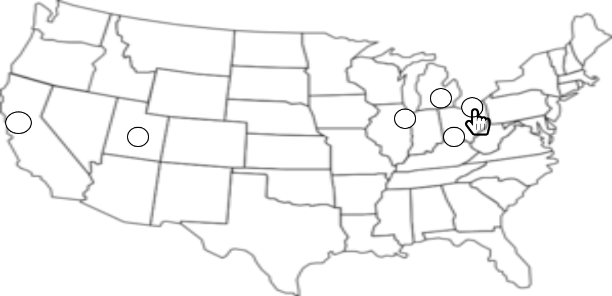
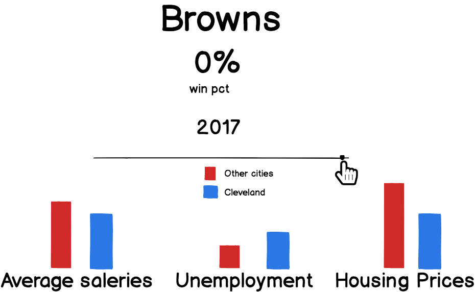

# How sports teams seasons affect their cities

### Background and Overview
This will be a data visualization.
I am interested to see if city's sports' teams records affect the city in any significant way.

### Functionality & MVP

* See a map of the United States
* Select a city
* See the major sports teams in that city, select a year (via a slider), which will show the teams records, as well as information about the city, ie housing prices, unemployment, crime, average annual income, etc.

### Wireframes
Main page. User can click on a city, (which will be a clickable circle)

User clicks on a city and zooms into the city to see the details.

### Architecture and Technologies
This project will be implemented with the following technologies:
* Vanilla JS for the logic and api requests
* API requests to get team records data as well as requests for city information
* Mapbox API for the US map
* HTML5 Canvas for graphics
* Webpack to bundle JS files

I think I will need at least 1 JS file to handle fetching all the data from the API's. I will need another file to manipulate the data and display certain information depending on what city the user clicks on.

### Implementation Timeline
**Day 1:**
Figure out how to get API's to get:
 * team records
 * unemployment
 * housing prices
 * average salaries
 * (more if I have time)

**Day 2:**
* Figure out how to show this online
* Create the logic to calculate stats for cities
* How to get the map from Mapbox to render
* Put the circles on the map

**Day 3:**
* Make the circles clickable and how to zoom into the map
* Figure out how to make the graphs

**Day 4:**
* Figure out how to render different information based on the year

### Bonus Features
* Get more data on cities. ie, suicides, crime, babies born, average level of education, etc.
* Compare the cities year with their average throughout the time period I'm calculating (instead of comparing it to the other cities averages)
